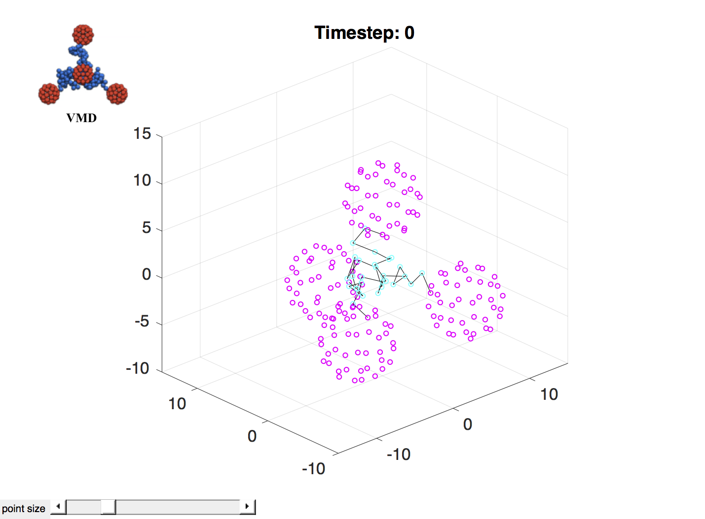

# HOOMD Utils

Contains scripts that help with HOOMD-related things.

## PlotXML.m

Plots coordinates and bonds in a HOOMD XML file.

Usage: `PlotXML(filename)`
Example: `PlotXML('FabPolymer.xml')` displays the example frame shown below.

